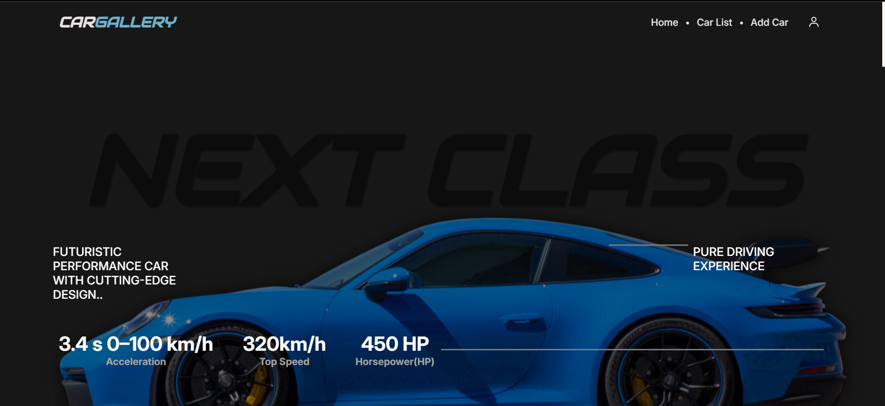
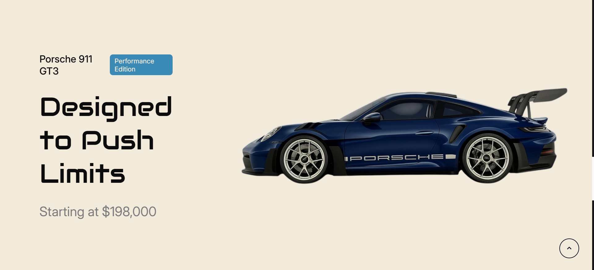
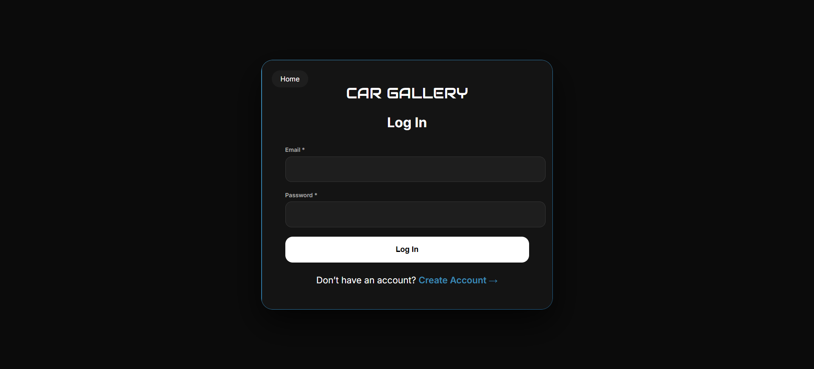
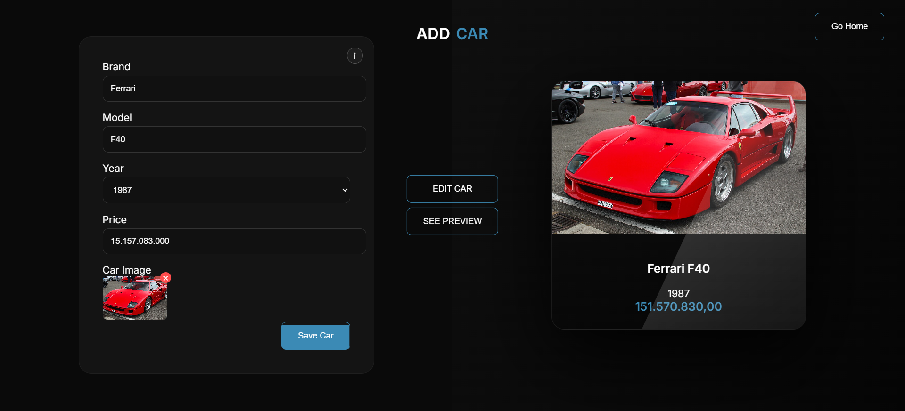
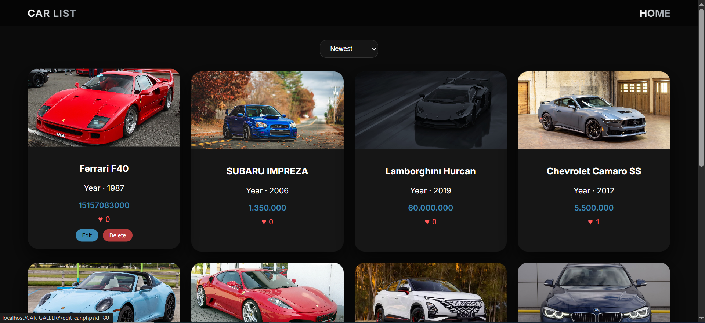
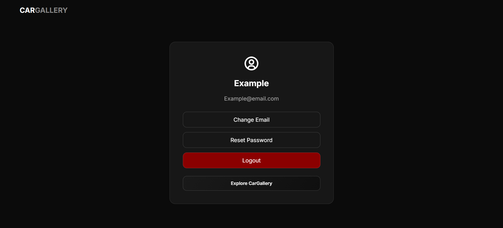
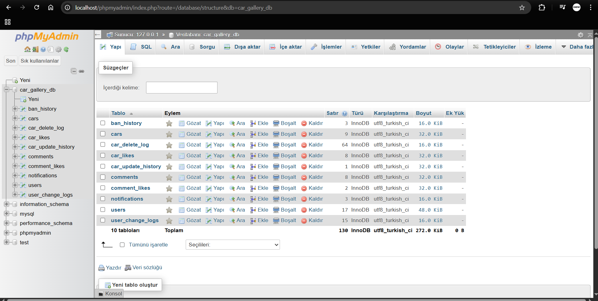

# 🚗 CarGallery

### *Interactive Car Showcase Platform*


  


<p align="center">
  
  
  
  
</p>

---

## 🌐 Live Demo

<p align="center">
  <a href="https://example.com">
    
  </a>
</p>

---

## 📖 Project Overview

CarGallery is a full-stack web application where users can explore cars, upload their own vehicles, interact through comments and likes, and manage their own content.

The project initially started as a simple university course assignment. The initial goals were only to:

* Add cars to a database
* Display cars in a simple interface

However, the project was gradually expanded and evolved into a much more advanced web platform. During approximately **4–5 months of development**, the project was redesigned and improved multiple times.

The final result is a **portfolio-level full-stack application** demonstrating strong practical experience in backend development, database management, security practices, and advanced frontend design.

This project was developed independently, with the entire development process carried out by me.

---

## 🧰 Tech Stack

**Frontend:**

* HTML
* CSS (Advanced UI design, animations, responsive layout)
* JavaScript (Advanced DOM manipulation, dynamic UI, AJAX)

**Backend:**

* PHP (MySQLi)

**Database:**

* MySQL (managed via phpMyAdmin)

---

## 📄 License & Usage

This project is a proprietary, portfolio-based application developed entirely by the author.

The source code is **not open for public use**.
Copying, modifying, distributing, or reusing any part of this codebase without explicit permission is strictly prohibited.

This repository is shared for **demonstration and evaluation purposes only**.

---

### 💼 Commercial Use & Access

The source code may be provided under specific conditions:

* For **employers or recruiters** who want to review the full implementation
* For **clients or individuals** interested in purchasing and adapting the project for their own use

📩 **Contact:** [bedirhan.elcik@stu.fbu.edu.tr](mailto:bedirhan.elcik@stu.fbu.edu.tr)

---

## 📸 Screenshots

### 🏠 Home


### 🚗 Car Gallery



### 🔐 Authentication



### ➕ Add Car



### 📋 Car List



### 👤 Profile



---

## 🖼️ Car Gallery

The main gallery page displays all vehicles uploaded by users.

**Features:**

* Grid-based car cards
* Smooth animations and visual effects
* Like counters
* Sorting options (Newest / Most liked / My Cars)
* Edit/Delete controls for content owners

---

## 💬 Comment System

Each vehicle has its own fully interactive comment section.

**Features:**

* Add / Edit / Delete comments
* Like comments
* Sorting (Newest / Most liked)
* Pagination system

AJAX is actively used across the system to provide dynamic updates without page reload:

* Comment loading
* Comment interactions
* Car updates and image changes

This significantly improves performance and user experience.

---

## 🛡️ Moderation System

The system includes moderation features to maintain platform integrity:

* User banning system
* Moderation history tracking
* Admin notes
* Activity logging

---

## 🏗️ System Architecture

### 📁 Project Structure

```plaintext
CAR_GALLERY/
│
├── index.php
├── assets/
├── auth/
├── cars/
├── comments/
├── profile/
├── config/
└── uploads/
```

---

## 🗄️ Database Structure

The application uses a relational MySQL database.

**Main tables:**

* users
* cars
* comments
* comment_likes
* car_likes
* notifications
* ban_history
* car_delete_log
* car_update_history
* user_change_logs

### 🗄️ Example



---

## 🔐 Security Implementation

🛡️ SQL injection protection (prepared statements)
🔑 Authentication systems
👮 Authorization controls
📁 File upload validation
🔐 Secure session management

---

## 📊 Database & Data Handling

* relational database design
* table relationships
* CRUD operations
* data validation
* structured data storage

---

## 📚 What I Learned From This Project

This project represents a full-stack development process built from scratch, covering frontend, backend, database design, authentication systems, and web security.

---

## 🎯 Project Purpose

* practice full stack development
* gain backend experience
* understand relational databases
* implement authentication systems
* apply web security techniques

---

## 👨‍💻 Developer

**Bedirhan Elçik**

MIS Student

Full Stack Development | Web Security | Database Systems
